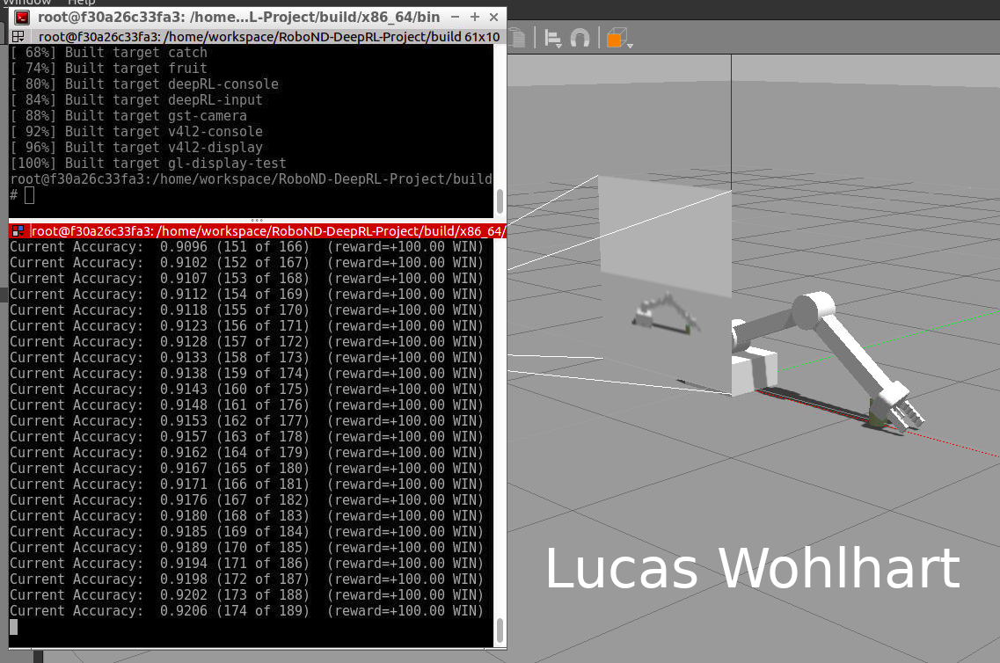
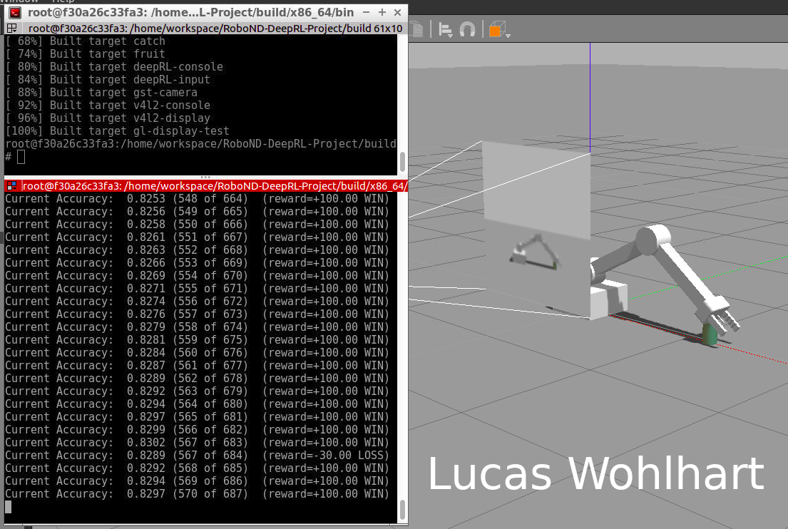

# Deep RL Arm Manipulation

This project is based on the Nvidia open source project "jetson-reinforcement" developed by [Dustin Franklin](https://github.com/dusty-nv). The goal of the project is to create a DQN agent and define reward functions to teach a robotic arm to carry out two primary objectives:

1. Have any part of the robot arm touch the object of interest, with at least a 90% accuracy.
2. Have only the gripper base of the robot arm touch the object, with at least a 80% accuracy.

## Building from Source (Nvidia Jetson TX2)

Run the following commands from terminal to build the project from source:

``` bash
$ sudo apt-get install cmake
$ git clone http://github.com/udacity/RoboND-DeepRL-Project
$ cd RoboND-DeepRL-Project
$ git submodule update --init
$ mkdir build
$ cd build
$ cmake ../
$ make
```

in case of a missing dependency installing `libignition-math2-dev` might help
```
sudo apt-get install libignition-math2-dev
```

During the `cmake` step, Torch will be installed so it can take awhile. It will download packages and ask you for your `sudo` password during the install.

## Evaluation

### Task 1 
To test the performance on task 1 build the project and run the follwing commands:
``` bash
$ cd RoboND-DeepRL-Project/build/aarch64/bin
$ chmod u+x gazebo-arm.sh
$ ./gazebo-arm.sh
```

The agent should converge to the accuracy as depicted beneath. (See training here https://youtu.be/n06wDGm7ll4)



### Task 2
To check task 2 where the can has to be touched with the gripper base part of the manipulator explicitly,
change the lines 273-274 in `gazebo/ArmPlugin.cpp` to
```
const bool correctCollision = (strcmp(contacts->contact(i).collision2().c_str(), COLLISION_POINT) == 0); // for task 2 checkCollision with gripper			
// const bool correctCollision = true;
```

Recompile the project and run 
```bash
$ cd RoboND-DeepRL-Project/build/aarch64/bin
$ ./gazebo-arm.sh
```
After a while the manipulator should learn to touch the can with its gripper base. (See training here https://youtu.be/frCadMNOyA0)


